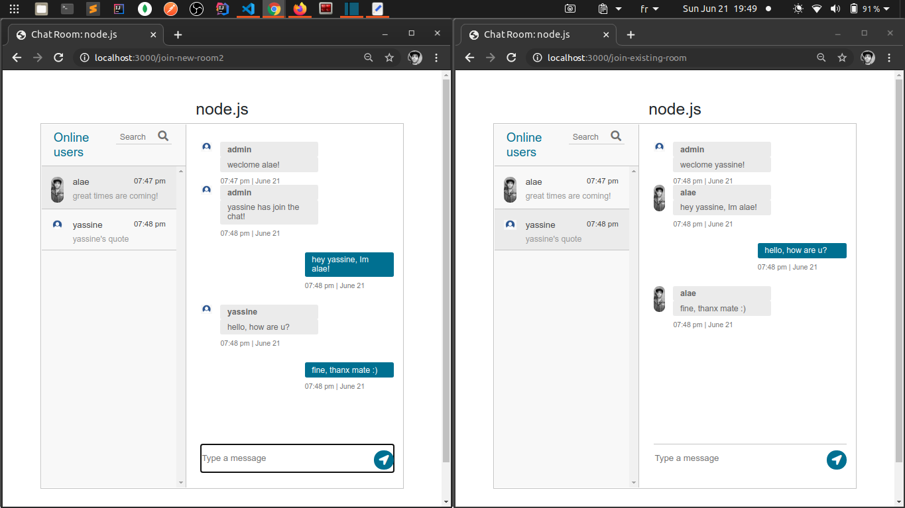

# Table of content

-   **[About](#about)**
-   **[Use It Locally](#use-it-locally)**
-   **[App Demo](#app-demo)**

<a name="about"></a>

# About

THis is a real time, web based, chat app, created with node.js and websockets, using the [socket.io](https://socket.io/) library.

users can:

-   create rooms and join existing ones
-   send and receive message in real time
-   see and search who's online

<a name="use-it-locally"></a>

# Use It Locally

```
    npm install
    npm run startdev
```

Go to: localhost:3000/

<a name="app-demo"></a>

# App Demo


